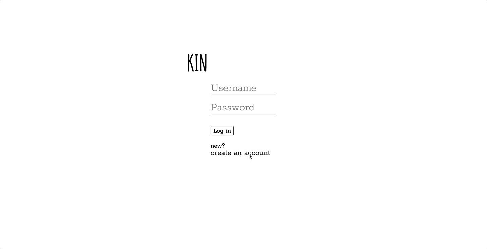

# README
## Kin
The best parts of life are often defined by the memories we make with other people. People — friends, family, *people* — help teach us about life and about ourselves, and in this way, they help us find meaning while we're here. We hold these memories in our hearts and feel them deeply, but every once in a while, years will go by before something — a smell, a song, the color of the sky — jogs a memory. Document it. Here. Let's spend more time reminding ourselves what life is really about. Spend more time remembering your kin. 
                                             
                                             Create an account
                                             


------------------------------------------------------------------------------------------------------------------------------

                                         Login and view your peeps
                                             


------------------------------------------------------------------------------------------------------------------------------

                                         Document, note, and reminisce
                                             


------------------------------------------------------------------------------------------------------------------------------

## Project setup
```
npm install
```

### Compiles and hot-reloads for development
```
npm run serve
```

### Compiles and minifies for production
```
npm run build
```

### Run your tests
```
npm run test
```

### Lints and fixes files
```
npm run lint
```

### Customize configuration
See [Configuration Reference](https://cli.vuejs.org/config/).
